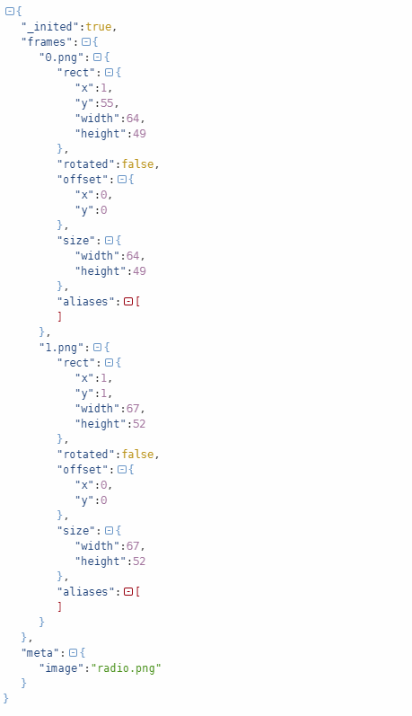

# cocos-pkgjson
## English
a pkgJson tool, convert plist file to json data. It can be custom pkgLoader used directly

## 中文说明
这是一个用于生成pkgJson的工具：将.plist文件中的数据提取出来，生成cocos底层SpriteFrame的数据结构，这样在加载.pkgJson之后，使用```cc._pkgJsonLoader```即可直接使用数据。避免了像在加载plist文件后，还需要解析plist数据才能生成底层需要的结构。简单言之：将解析plist的数据提前，减少网络请求，加快数据获取。

有这个想法写这个工具也是由于看到了这篇文章：[cc.spriteFrameCache 改造说明](http://www.cocos.com/docs/html5/v3/cc-spriteframecache/zh.html)，但是官方并没有提供pkgJson文件的生成方式，而且个人在生成pkgJson的同时，也在官方的原基础做了一次优化，生成的pkgJson一次到位，cc._pkgJsonLoader只负责将数据存储在cc.loader.cache中即可。

## How to Use
#### Node.js
Install using npm:

```
npm i cocos-pkgjson
```

Then require() the cocos-pkgjson module in your file:
```
const fs = require('fs');
const pkgJson = require('./cocos-pkgjson');

// Here I use fs.readFileSync get .plist file content
let content = fs.readFileSync("test.plist", "utf8");

console.log(JSON.stringify(pkgJson.parseFrameConfig(content)));
```

String result:
```
{"_inited":true,"frames":{"0.png":{"rect":{"x":1,"y":55,"width":64,"height":49},"rotated":false,"offset":{"x":0,"y":0},"size":{"width":64,"height":49},"aliases":[]},"1.png":{"rect":{"x":1,"y":1,"width":67,"height":52},"rotated":false,"offset":{"x":0,"y":0},"size":{"width":67,"height":52},"aliases":[]}},"meta":{"image":"radio.png"}}
```

Json result:




### 配套的cc._pkgJsonLoader
```
cc._pkgJsonLoader = {
    load: function (realUrl, url, res, cb) {
        var self = this, locLoader = cc.loader, cache = locLoader.cache;
        locLoader.loadJson(realUrl, function (err, pkg) {
            if (err) return cb(err);
            var dir = cc.path.dirname(url);
            for (var key in pkg) {
                var filePath = cc.path.join(dir, key);
                cache[filePath] = pkg[key];
            }
            cb(null, true);
        });
    }
};

cc.loader.register(["pkgJson"], cc._pkgJsonLoader);
```